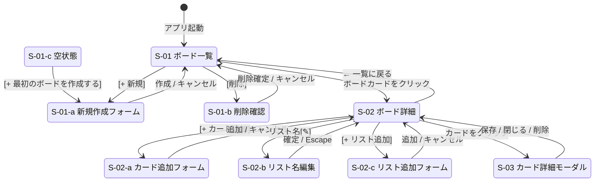

# 使用者画面設計（ワイヤーフレーム）

## S-01: ボード一覧

```
┌─────────────────────────────────────────────────────┐
│  🗂 タスクボード                              [+ 新規] │
├─────────────────────────────────────────────────────┤
│                                                     │
│  ┌───────────┐  ┌───────────┐  ┌───────────┐       │
│  │ 仕事       │  │ プライベート│  │ 学習      │       │
│  │           │  │           │  │           │       │
│  │ カード 5枚 │  │ カード 3枚 │  │ カード 8枚│       │
│  │           │  │           │  │           │       │
│  │      [削除]│  │      [削除]│  │      [削除]│       │
│  └───────────┘  └───────────┘  └───────────┘       │
│                                                     │
└─────────────────────────────────────────────────────┘
```

---

## S-01-a: ボード新規作成フォーム（S-01のインライン展開）

```
┌─────────────────────────────────────────────────────┐
│  🗂 タスクボード                              [+ 新規] │
├─────────────────────────────────────────────────────┤
│                                                     │
│  ┌───────────┐  ┌───────────┐  ┌───────────────┐   │
│  │ 仕事       │  │ プライベート│  │ ボード名を入力 │   │
│  │           │  │           │  │               │   │
│  │ カード 5枚 │  │ カード 3枚 │  │ [テキスト入力] │   │
│  │           │  │           │  │               │   │
│  │      [削除]│  │      [削除]│  │  [作成] [×]  │   │
│  └───────────┘  └───────────┘  └───────────────┘   │
│                                                     │
└─────────────────────────────────────────────────────┘
```

---

## S-01-b: ボード削除確認ダイアログ

```
┌─────────────────────────────────────────────────────┐
│ ░░░░░░░░░░░░░░░░░░░░░░░░░░░░░░░░░░░░░░░░░░░░░░░░░░ │
│ ░░░  ┌────────────────────────────────┐  ░░░░░░░░ │
│ ░░░  │ ボードを削除しますか？          │  ░░░░░░░░ │
│ ░░░  │                               │  ░░░░░░░░ │
│ ░░░  │ 「仕事」とその中のリスト・カード │  ░░░░░░░░ │
│ ░░░  │ がすべて削除されます。          │  ░░░░░░░░ │
│ ░░░  │ この操作は元に戻せません。      │  ░░░░░░░░ │
│ ░░░  │                               │  ░░░░░░░░ │
│ ░░░  │    [削除する]    [キャンセル]   │  ░░░░░░░░ │
│ ░░░  └────────────────────────────────┘  ░░░░░░░░ │
│ ░░░░░░░░░░░░░░░░░░░░░░░░░░░░░░░░░░░░░░░░░░░░░░░░░░ │
└─────────────────────────────────────────────────────┘
```

---

## S-01-c: ボード一覧（空状態）

```
┌─────────────────────────────────────────────────────┐
│  🗂 タスクボード                              [+ 新規] │
├─────────────────────────────────────────────────────┤
│                                                     │
│                                                     │
│                      📋                             │
│              ボードがまだありません                    │
│            [+ 最初のボードを作成する]                  │
│                                                     │
│                                                     │
└─────────────────────────────────────────────────────┘
```

---

## S-02: ボード詳細

```
┌─────────────────────────────────────────────────────────────────┐
│ ← 一覧に戻る   📋 仕事                              [+ リスト追加] │
├─────────────────────────────────────────────────────────────────┤
│                                                                 │
│  ┌──────────────┐  ┌──────────────┐  ┌──────────────┐         │
│  │ ToDo    [✎] │  │ Doing   [✎] │  │ Done    [✎] │         │
│  ├──────────────┤  ├──────────────┤  ├──────────────┤         │
│  │ ┌──────────┐ │  │ ┌──────────┐ │  │ ┌──────────┐ │         │
│  │ │ 要件定義  │ │  │ │ 画面設計  │ │  │ │ 環境構築  │ │         │
│  │ │      [×] │ │  │ │      [×] │ │  │ │      [×] │ │         │
│  │ └──────────┘ │  │ └──────────┘ │  │ └──────────┘ │         │
│  │ ┌──────────┐ │  │              │  │              │         │
│  │ │ DB設計   │ │  │              │  │              │         │
│  │ │      [×] │ │  │              │  │              │         │
│  │ └──────────┘ │  │              │  │              │         │
│  │              │  │              │  │              │         │
│  │ [+ カード追加]│  │ [+ カード追加]│  │ [+ カード追加]│         │
│  └──────────────┘  └──────────────┘  └──────────────┘         │
│                                                                 │
└─────────────────────────────────────────────────────────────────┘
```

---

## S-02-a: カード追加インラインフォーム

```
│  ┌──────────────┐
│  │ ToDo    [✎] │
│  ├──────────────┤
│  │ ┌──────────┐ │
│  │ │ 要件定義  │ │
│  │ │      [×] │ │
│  │ └──────────┘ │
│  │              │
│  │ ┌──────────┐ │  ← テキスト入力欄（自動フォーカス）
│  │ │          │ │
│  │ └──────────┘ │
│  │ [追加] [×]   │
│  └──────────────┘
```

---

## S-02-b: リスト名インライン編集

```
│  ┌──────────────┐
│  │[  ToDo   ][✓]│  ← タイトルが input に切り替わる
│  ├──────────────┤
│  │ ┌──────────┐ │
│  │ │ 要件定義  │ │
│  │ └──────────┘ │
│  └──────────────┘
```

---

## S-02-c: リスト追加フォーム

```
┌──────────────┐  ┌──────────────┐  ┌───────────────┐
│ ToDo    [✎] │  │ Done    [✎] │  │ リスト名を入力 │
├──────────────┤  ├──────────────┤  │ [テキスト入力] │
│              │  │              │  │               │
│              │  │              │  │  [追加] [×]   │
└──────────────┘  └──────────────┘  └───────────────┘
```

---

## S-02-d: カードドラッグ中状態

```
│  ┌──────────────┐  ┌──────────────┐  ┌──────────────┐
│  │ ToDo    [✎] │  │ Doing   [✎] │  │ Done    [✎] │
│  ├──────────────┤  ├──────────────┤  ├──────────────┤
│  │ ┌──────────┐ │  │ ┌──────────┐ │  │              │
│  │ │░░░░░░░░░░│ │  │ │ 画面設計  │ │  │ ┌ ─ ─ ─ ─ ┐ │  ← ドロップゾーン
│  │ │░ 要件定義 │ │  │ │      [×] │ │  │   （点線）   │
│  │ │░(ドラッグ)│ │  │ └──────────┘ │  │ └ ─ ─ ─ ─ ┘ │
│  │ │░░░░░░░░░░│ │  │              │  │              │
│  │ └──────────┘ │  │              │  │              │
│  │ ┌ ─ ─ ─ ─ ┐ │  │              │  │              │
│  │   （幽霊）   │  │              │  │              │
│  │ └ ─ ─ ─ ─ ┘ │  │              │  │              │
```

| 要素 | 見た目 |
|-----|--------|
| ドラッグ中のカード | 半透明・影付き・カーソルが `grabbing` |
| 元の位置（幽霊） | 薄いグレーの枠のみ残す |
| ドロップゾーン | 点線ボーダー・背景色を薄く変更 |
| ドロップ可能なリスト | 背景色をハイライト |

---

## S-03: カード詳細モーダル

```
┌─────────────────────────────────────────────────────┐
│ ░░░░░░░░░░░░░░░░░░░░░░░░░░░░░░░░░░░░░░░░░░░░░░░░░░ │
│ ░░░  ┌───────────────────────────────────┐  ░░░░░ │
│ ░░░  │                              [閉じる]│  ░░░░░ │
│ ░░░  │ タイトル                           │  ░░░░░ │
│ ░░░  │ ┌─────────────────────────────┐   │  ░░░░░ │
│ ░░░  │ │ 画面設計                    │   │  ░░░░░ │
│ ░░░  │ └─────────────────────────────┘   │  ░░░░░ │
│ ░░░  │                                   │  ░░░░░ │
│ ░░░  │ 説明                              │  ░░░░░ │
│ ░░░  │ ┌─────────────────────────────┐   │  ░░░░░ │
│ ░░░  │ │ ワイヤーフレームと           │   │  ░░░░░ │
│ ░░░  │ │ 遷移図を作成する             │   │  ░░░░░ │
│ ░░░  │ └─────────────────────────────┘   │  ░░░░░ │
│ ░░░  │                                   │  ░░░░░ │
│ ░░░  │  所属リスト: Doing                 │  ░░░░░ │
│ ░░░  │  作成日: 2026-05-01               │  ░░░░░ │
│ ░░░  │  更新日: 2026-05-02               │  ░░░░░ │
│ ░░░  │                                   │  ░░░░░ │
│ ░░░  │       [保存]        [削除]         │  ░░░░░ │
│ ░░░  └───────────────────────────────────┘  ░░░░░ │
│ ░░░░░░░░░░░░░░░░░░░░░░░░░░░░░░░░░░░░░░░░░░░░░░░░░░ │
└─────────────────────────────────────────────────────┘
```

---

## S-M: モバイルレイアウト（768px以下）

### ボード一覧（モバイル）

```
┌──────────────────────┐
│ 🗂 タスクボード  [+]  │
├──────────────────────┤
│ ┌────────────────┐   │
│ │ 仕事            │   │
│ │ カード 5枚  [削除]│   │
│ └────────────────┘   │
│ ┌────────────────┐   │
│ │ プライベート    │   │
│ │ カード 3枚  [削除]│   │
│ └────────────────┘   │
└──────────────────────┘
```

### ボード詳細（モバイル）

```
┌──────────────────────┐
│ ← 仕事       [+リスト]│
├──────────────────────┤
│ ┌────────────────┐   │
│ │ ToDo      [✎] │   │
│ ├────────────────┤   │
│ │ ┌────────────┐ │   │
│ │ │ 要件定義    │ │   │
│ │ │        [×] │ │   │
│ │ └────────────┘ │   │
│ │ [+ カード追加]  │   │
│ └────────────────┘   │
│ ┌────────────────┐   │
│ │ Doing     [✎] │   │
│ └────────────────┘   │
└──────────────────────┘
```

> モバイルではD&Dを無効にし、カード詳細モーダル内のセレクトボックスでリスト移動します。

---

## S-E: エラートースト（全画面共通）

```
┌─────────────────────────────────────────────────────┐
│                                                     │
│                        ┌──────────────────────────┐ │
│                        │ ⚠ 保存に失敗しました       │ │
│                        │ ネットワークエラー          │ │
│                        │                      [×] │ │
│                        └──────────────────────────┘ │
└─────────────────────────────────────────────────────┘
```

| 種別 | 色 |
|-----|----|
| エラー | 赤背景・白文字 |
| 成功 | 緑背景・白文字 |

---

## 画面遷移図


