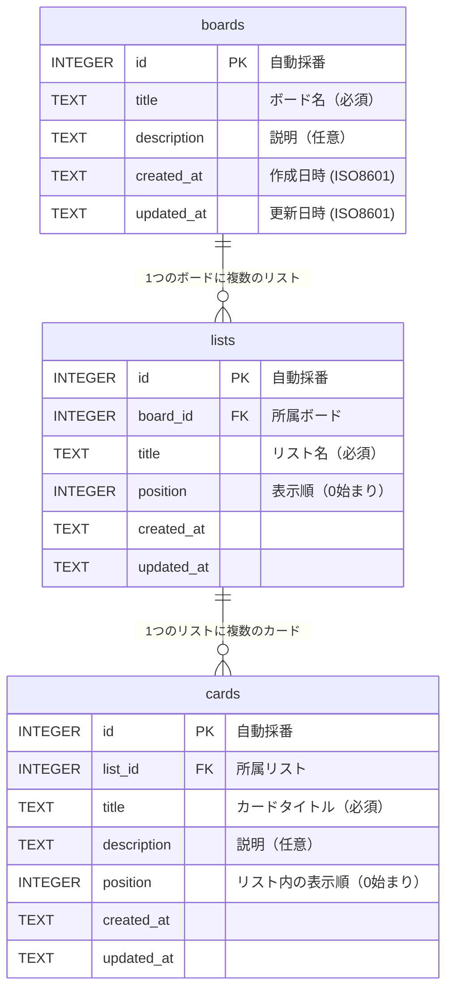

# ER図

## エンティティ一覧

| テーブル名 | 説明 |
|----------|------|
| `boards` | ボード（タスク管理の大枠） |
| `lists` | リスト（ボード内のカラム。例: ToDo / Doing / Done） |
| `cards` | カード（個々のタスク） |

> 学習目的のシングルユーザー構成のため、`users` テーブルは含みません。
> 将来的に追加する場合は `boards` に `user_id` を追加します。

---

## ER図

---

## リレーション

| 親テーブル | 子テーブル | 種別 | 制約 |
|----------|----------|------|------|
| `boards` | `lists` | 1対多 | `ON DELETE CASCADE`（ボード削除でリストも削除） |
| `lists` | `cards` | 1対多 | `ON DELETE CASCADE`（リスト削除でカードも削除） |
