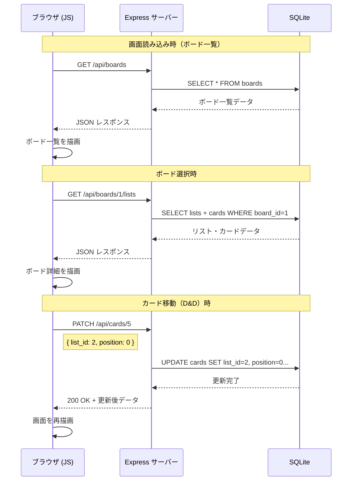

# データベース設計

## テーブル定義（DDL / SQLite）

```sql
-- ボード
CREATE TABLE boards (
    id          INTEGER PRIMARY KEY AUTOINCREMENT,
    title       TEXT    NOT NULL,
    description TEXT,
    created_at  TEXT    NOT NULL DEFAULT (datetime('now', 'localtime')),
    updated_at  TEXT    NOT NULL DEFAULT (datetime('now', 'localtime'))
);

-- リスト
CREATE TABLE lists (
    id         INTEGER PRIMARY KEY AUTOINCREMENT,
    board_id   INTEGER NOT NULL REFERENCES boards(id) ON DELETE CASCADE,
    title      TEXT    NOT NULL,
    position   INTEGER NOT NULL DEFAULT 0,
    created_at TEXT    NOT NULL DEFAULT (datetime('now', 'localtime')),
    updated_at TEXT    NOT NULL DEFAULT (datetime('now', 'localtime'))
);

-- カード
CREATE TABLE cards (
    id          INTEGER PRIMARY KEY AUTOINCREMENT,
    list_id     INTEGER NOT NULL REFERENCES lists(id) ON DELETE CASCADE,
    title       TEXT    NOT NULL,
    description TEXT,
    position    INTEGER NOT NULL DEFAULT 0,
    created_at  TEXT    NOT NULL DEFAULT (datetime('now', 'localtime')),
    updated_at  TEXT    NOT NULL DEFAULT (datetime('now', 'localtime'))
);
```

---

## フィールド詳細

### boards

| カラム | 型 | 必須 | 説明 |
|------|---|------|------|
| `id` | INTEGER | - | 主キー・自動採番 |
| `title` | TEXT | ✓ | ボード名 |
| `description` | TEXT | - | ボードの説明（任意） |
| `created_at` | TEXT | ✓ | 作成日時（ISO8601形式） |
| `updated_at` | TEXT | ✓ | 更新日時（ISO8601形式） |

### lists

| カラム | 型 | 必須 | 説明 |
|------|---|------|------|
| `id` | INTEGER | - | 主キー・自動採番 |
| `board_id` | INTEGER | ✓ | 所属ボードのID（外部キー） |
| `title` | TEXT | ✓ | リスト名 |
| `position` | INTEGER | ✓ | ボード内の表示順（0始まり） |
| `created_at` | TEXT | ✓ | 作成日時 |
| `updated_at` | TEXT | ✓ | 更新日時 |

### cards

| カラム | 型 | 必須 | 説明 |
|------|---|------|------|
| `id` | INTEGER | - | 主キー・自動採番 |
| `list_id` | INTEGER | ✓ | 所属リストのID（外部キー） |
| `title` | TEXT | ✓ | カードのタイトル |
| `description` | TEXT | - | カードの説明文（任意・複数行） |
| `position` | INTEGER | ✓ | リスト内の表示順（0始まり） |
| `created_at` | TEXT | ✓ | 作成日時 |
| `updated_at` | TEXT | ✓ | 更新日時 |

---

## `position` フィールドの運用

カード・リストの並び順を管理する整数値。

### 更新タイミング

| 操作 | 更新内容 |
|-----|---------|
| リスト内でカードを並び替え | 対象リスト内の全カードの `position` を更新 |
| カードを別リストへ移動 | `list_id` を変更し、移動先の `position` を割り当て |
| リストを並び替え | 全リストの `position` を更新 |

### 実装方針（学習段階）

```
position: 0, 1, 2, 3, ...
```

移動のたびに対象リスト内のカードを全件取得 → 並び替え → 全件 `position` を更新する。

### 将来の改善（参考）

`position` に浮動小数点数（例: 1.0, 2.0, 3.0）を使い、間に挿入する場合は中間値（1.5）を使う方式（Jira等で採用）。更新頻度を大幅に減らせる。

---

## データの流れ



---

## 初期データ（サンプル）

アプリ起動時にDBが空の場合、以下のサンプルデータを投入する。

```sql
INSERT INTO boards (title) VALUES ('サンプルボード');

INSERT INTO lists (board_id, title, position) VALUES
  (1, 'ToDo',  0),
  (1, 'Doing', 1),
  (1, 'Done',  2);

INSERT INTO cards (list_id, title, position) VALUES
  (1, 'はじめてのカード', 0);
```
