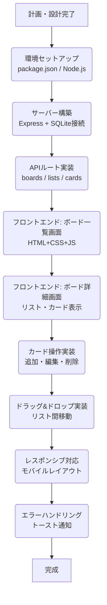

# Trello風タスク管理アプリ 開発計画

## 1. アプリケーション概要

Trello風のタスク管理Webアプリ。ボード・リスト・カードの3階層でタスクを管理する。
学習目的のシングルユーザー向けアプリ（マルチユーザー・認証機能なし）。

---

## 2. 技術スタック

| レイヤー | 技術 | 理由 |
|--------|------|------|
| フロントエンド | HTML / CSS / Vanilla JS | フレームワーク不使用で基礎を学ぶ |
| バックエンド | Node.js + Express | JSで統一できる、学習コストが低い |
| データベース | SQLite（開発） | サーバー不要でファイル1つで始められる |
| 通信 | REST API（fetch API） | HTTPの仕組みを学べる |

### アーキテクチャ

```
ブラウザ (HTML/CSS/JS)
    ↕ HTTP (REST API / JSON)
Node.js + Express サーバー
    ↕ SQL
SQLite
```

---

## 3. コア機能

詳細は `docs/01_機能一覧.md` を参照。

- **ボード管理**: 一覧表示・作成・削除
- **リスト管理**: 作成・名前編集・削除
- **カード管理**: 作成・詳細編集・削除・ドラッグ＆ドロップによるリスト間移動
- **レスポンシブ対応**: デスクトップ（769px以上）／モバイル（768px以下）
- **エラー通知**: API失敗時のトースト表示

---

## 4. ドキュメント構成

| ファイル | 内容 |
|--------|------|
| `docs/01_機能一覧.md` | 機能の一覧表 |
| `docs/02_機能要件.md` | 各機能の詳細要件・バリデーション・APIエンドポイント |
| `docs/03_画面要件.md` | 各画面の表示要件と操作要件 |
| `docs/04_使用者画面設計.md` | ワイヤーフレーム全画面・画面遷移図 |
| `docs/05_ER図.md` | エンティティ一覧・ER図 |
| `docs/06_データベース設計.md` | DDL・データの流れ・初期データ |

---

## 5. プロジェクトファイル構成

```
/taskmanagement/
├── client/
│   ├── index.html
│   ├── style.css
│   └── script.js
├── server/
│   ├── index.js          ← Expressサーバー起動
│   ├── db.js             ← DB接続・初期化
│   └── routes/
│       ├── boards.js     ← /api/boards
│       ├── lists.js      ← /api/lists
│       └── cards.js      ← /api/cards
├── database.sqlite        ← 自動生成
├── docs/
├── plans/
└── package.json
```

---

## 6. 開発ステップ



### ステップ詳細

1. **環境セットアップ**
   - `package.json` 作成、`express` / `better-sqlite3` をインストール
   - フォルダ構成（`client/` `server/`）を作成

2. **サーバー構築**
   - `server/index.js` でExpressを起動
   - `server/db.js` でSQLite接続・テーブル作成・初期データ投入

3. **APIルート実装**
   - `GET /api/boards`・`POST /api/boards`・`DELETE /api/boards/:id`
   - `GET /api/boards/:id/lists`・`POST /api/lists`・`PATCH /api/lists/:id`・`DELETE /api/lists/:id`
   - `POST /api/cards`・`PATCH /api/cards/:id`・`DELETE /api/cards/:id`

4. **フロントエンド: ボード一覧画面**
   - `client/index.html` の基本構造作成
   - APIからボード一覧を取得して描画
   - ボード作成・削除フォームの実装

5. **フロントエンド: ボード詳細画面**
   - ボードクリックでリスト・カードを取得して描画
   - リスト追加・リスト名編集の実装

6. **カード操作実装**
   - カード追加フォーム（インライン）
   - カード詳細モーダル（編集・削除）

7. **ドラッグ＆ドロップ実装**
   - リスト間・リスト内のカード移動
   - `position` の更新

8. **レスポンシブ対応**
   - メディアクエリでモバイルレイアウトに切り替え
   - モバイルでのカード移動（セレクトボックス）

9. **エラーハンドリング**
   - API失敗時のトースト通知
   - 入力バリデーションのエラー表示
